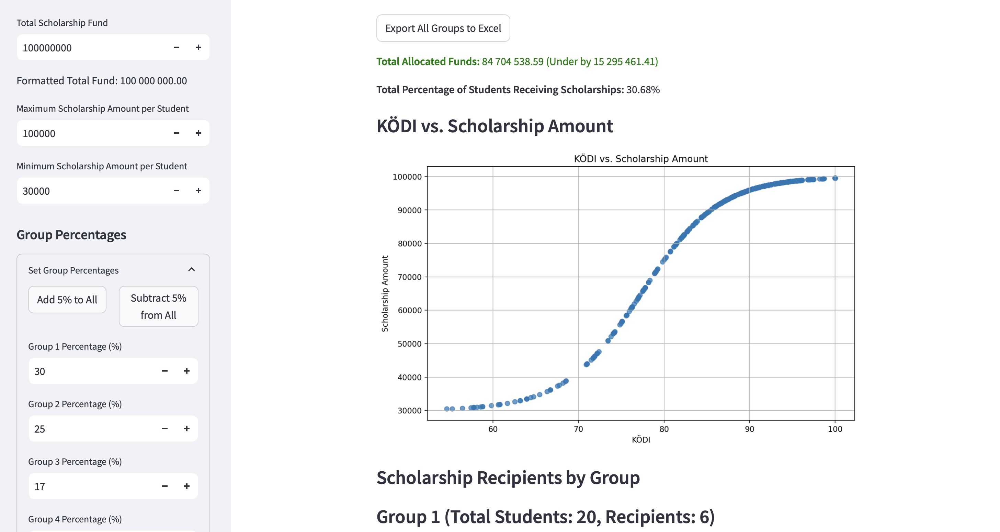

# University scholarship calculation tool

Copyright 2024, Bercel Kovalik-Deák, All rights reserved

The tools can be accessed through this landing page: https://mainmenu.streamlit.app

// To test the 2nd Step of the application, download the Sample_Data.xlsx. For protection of personal information, this is the same structure used in the original excels, just with AI generated data, and only 500 rows instead of 7000+. //

This project was developed in response to recent changes in the Regulation on Student Fees and Benefits at my university, requiring a new approach to scholarship calculations. The task was to create a tool that automates the calculation of scholarship scores for students, addressing both complex grouping and redistribution logic while maintaining transparency and accuracy in the process.

## Project Overview
The tool processes student data from an input Excel file containing 7000+ records to calculate a scholarship index (Ösztöndíjindex) based on their academic performance and credits. 

### 1st Step
Students are grouped according to their program name ('KépzésNév'), level of study ('Képzési szint'), and language ('Nyelv ID'—either 'angol' or 'magyar'). They are further classified into year levels based on their active semesters: 
- 1-2 semesters: 1st year
- 3-4 semesters: 2nd year
- 5-6 semesters: 3rd year
- 7-8 semesters: 4th year

Moreover, the students Scholarship Index and KÖDI (see below the formula) is calculated and added to the table.

### 2nd Step
Here we need to upload the output excel file of 1st step, and the tool will distribute the given scholarship fund between the students by a Sigmoid function. The curve's steepness and midpoint is adjustable, moreover the maximum and minimum receivable amount, and the percentage of students getting scholarship in each group.

### 3rd Step
After the completion of the calculation, we only need to merge the original input excel with the 2nd step output file, and we will have a complete dataset containing both students who didn't get and those who got scholarship.

Year groups with fewer than 10 students are redistributed to the closest adjacent group. This redistribution process ensures that students from smaller groups are merged with larger groups, running upward or downward depending on availability, to maintain a minimum threshold of 10 students per group. If an entire program has fewer than 10 students, they are excluded from redistribution and processed separately.

## Key Features
-__Dynamic Grouping and Redistribution:__ Automatically identifies small groups and redistributes students into adjacent groups while ensuring no loss of student data.

-__Distribution of Allocated Amount:__ Includes an adjustable Sigmoid function that distributes the given scholarship fund among students based on their calculated scores (KÖDI). This ensures a fair distribution aligned with the adjusted scholarship index.

-__Interactive Streamlit GUI:__ A user-friendly interface built with Streamlit allows users to visualize data through graphs, review the grouped students, and adjust parameters such as distribution amounts and group thresholds. This provides a flexible way to fine-tune the scholarship calculation and see real-time results.

-__Calculation of Scholarship Scores (KÖDI):__ For each group, students receive a score between 0 and 100 based on their position relative to the minimum and maximum scholarship index values in their group. The formula used is:

The formula used is:

 _KÖDI = ((HallgÖDI - MinÖDI) / (MaxÖDI - MinÖDI)) x 100_ 

Where:

- HallgÖDI is the student's Ösztöndíjindex.
- MinÖDI is the lowest Ösztöndíjindex in the group.
- MaxÖDI is the highest Ösztöndíjindex in the group.
- Output Structure: Generates two output files:

A primary file with updated student year levels and scholarship indices, excluding students from programs with fewer than 10 students.
A separate file containing students from small programs, preserving their original details along with their recalculated year level and Ösztöndíjindex.
This solution not only simplifies the scholarship calculation process but also ensures compliance with the new regulation, creating a fairer and more accurate assessment for all students.

## Handling Edge Cases
The tool is designed to account for various edge cases, ensuring robust performance:

-__Students Enrolled in Multiple Courses:__ Properly accounts for students who are part of more than one course to avoid duplications or unfair calculations.

-__Small Groups and Low Enrollment Programs:__ Handles groups where the total number of students does not reach 10, ensuring that these students are treated fairly either through redistribution or exclusion, with adjusted calculations as necessary.

-__Flexible Adjustments:__ The Streamlit GUI allows for adjusting thresholds and parameters to accommodate unique cases, ensuring the tool adapts to varying data sets and regulatory requirements.

This solution not only simplifies the scholarship calculation process but also ensures compliance with the new regulation, creating a fairer and more accurate assessment for all students.

## Technologies Used
- Python: For data processing, logic implementation, and automation.
- Pandas: To manage and manipulate student data efficiently.
- Streamlit: For creating an interactive GUI that allows real-time adjustments and visualizations.
- Excel: As the primary format for input and output files, ensuring easy integration with existing university workflows.

Feel free to explore the code and adapt it to similar scholarship distribution scenarios.
